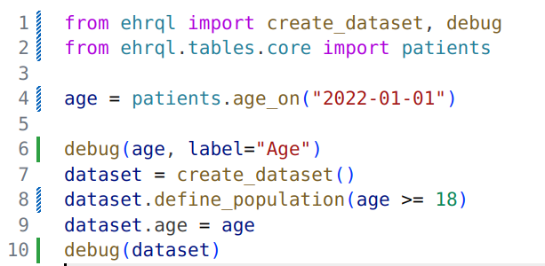
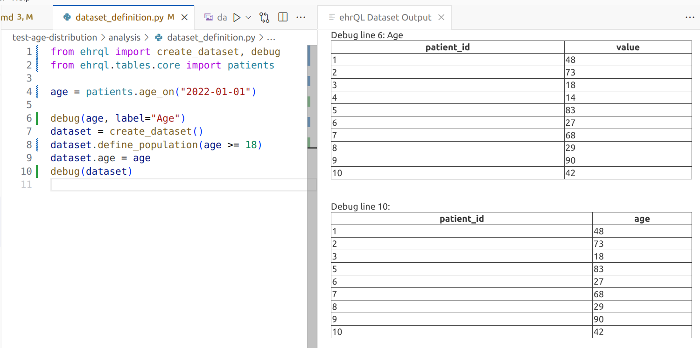

# opensafely-vscode

NOTE: This extension is currently under development and is subject to change without warning!

This is a VSCode extension for working with the [OpenSAFELY](www.opensafely.org) tools.

Currently, it supports debugging ehrQL[^1] variables and displaying the dataset
produced from an ehrQL dataset definition, using a set of dummy data tables.

Note that this extension can only be run with dummy data, as a local debugging tool.


## Features

Debug ehrQL variables and datasets within a dataset definition.

1. Open a folder that contains a dataset definition file in VS Code (the file does not
  need to be at the root of the folder). Typically this will be an openSAFELY study repository.

2. Open the dataset definition file in the VS Code editor and import ehrQL debug features:
  ```
  from ehrql.debug import show, stop
  ```

3. Show the contents of a variable:
  ```
  show(<varible>)
  ```

4. Click on the "Debug ehrQL" menu bar button, or Ctrl+Shift+P and select the "ehrQL: Debug dataset"
command. Hovering over the menu bar button will display a tooltip showing the location of the
dummy data tables that will be used by the ehrQL debugger.


The following dataset definition filters patients to only those over 18, and shows the
`age` variable (with an optional label) on line 6. 



Running the ehrQL debug opens the debug output in an adjacent panel.




## Requirements

Requires the `opensafely` package. This can be set explicitly as an (extension setting)[#extension-settings]. 

```pip install opensafely```

## Extension Settings

This extension contributes the following settings:

* `opensafely.enable`: Enable/disable this extension.
* `opensafely.DummyTablesDir`: Set to the name of a directory in the workspace folder that
  contains dummy tables. Defaults to `dummy_tables`. See the
  [opensafely documentation](https://docs.opensafely.org/ehrql/how-to/dummy-data/#supply-your-own-dummy-tables)
  for information on how opensafely can generate dummy tables for you.
* `opensafely.opensafelyPath`: optional; path to an opensafely executable. If not provided,
  the extension will look for an opensafely install in a virtual environment local to the
  workspace directory, and will fall back to an `opensafely` installed in an activated or
  system-wide.
* `opensafely.EHRQLImageVersion`: ehrQL docker image version; defaults to the current most recent
  production image (v1).


[^1]: <https://docs.opensafely.org/ehrql>
